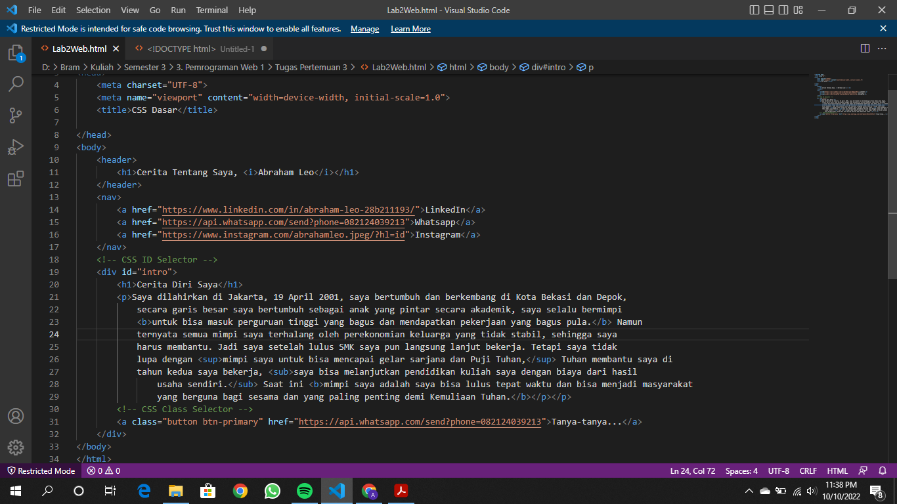
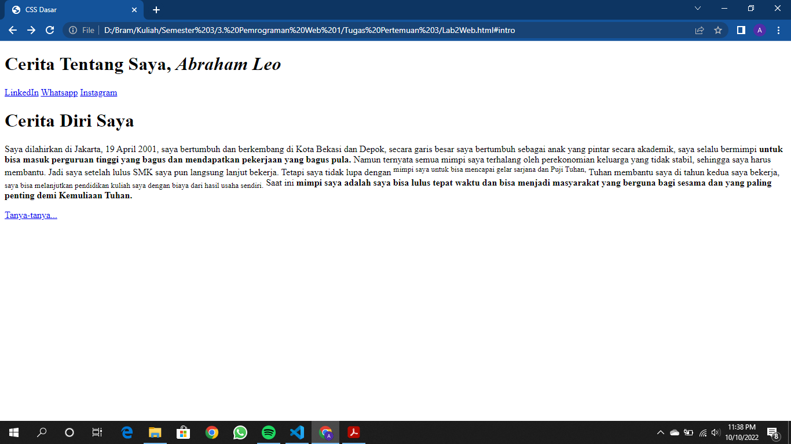
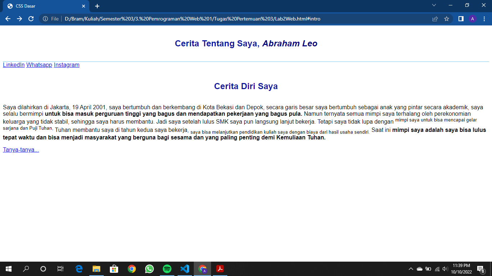
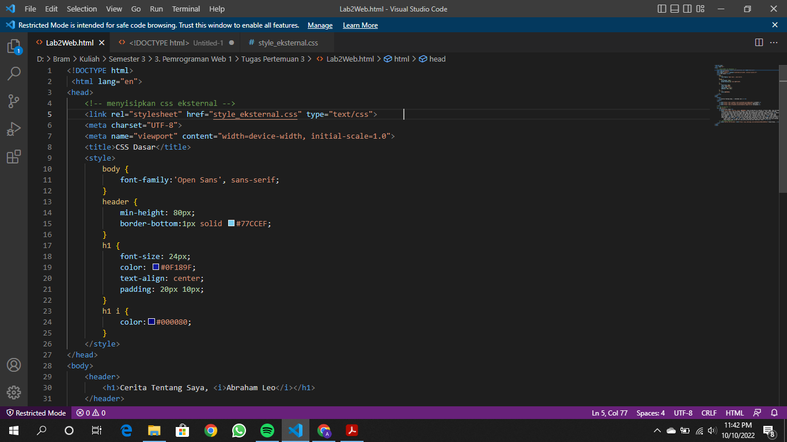
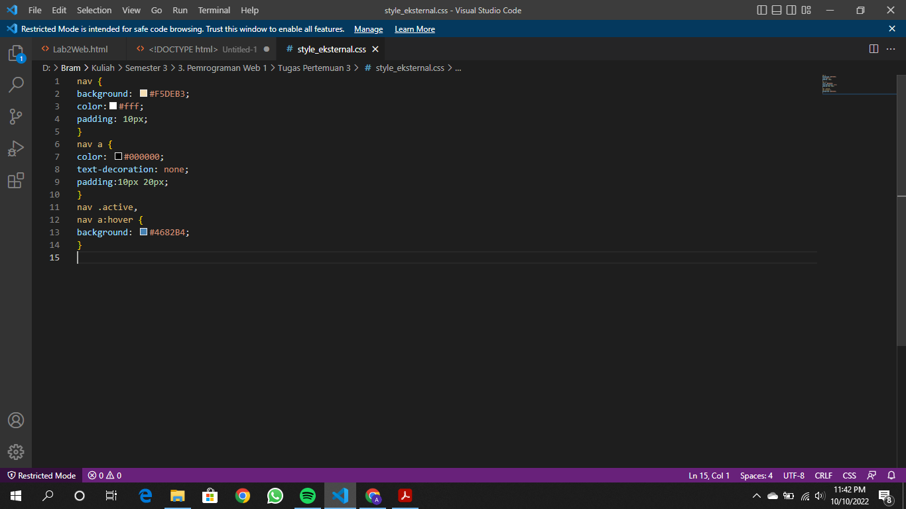
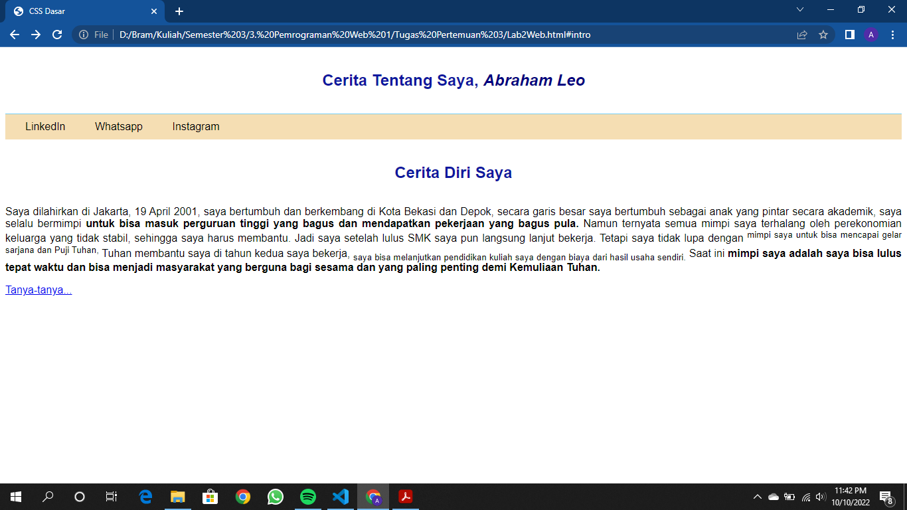
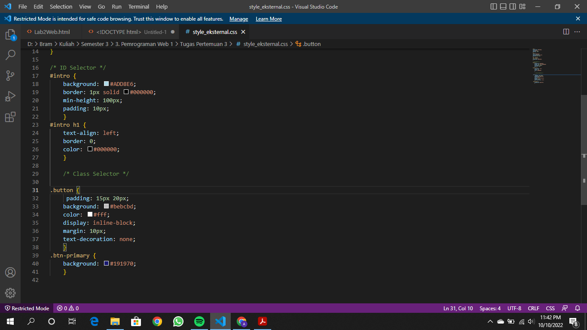

# Lab2Web

## CSS Dasar

### 1. Membuat dokumen HTML 
Buatlah dokumen HTML seperti berikut:
  
#### Ini hasilnya
  

### 2. Mendeklarasikan CSS Internal
Kemudian tambahkan deklarasi CSS internal seperti berikut pada bagian head dokumen:
  
#### Lalu inilah hasilnya:
  

### 3. Menambahkan Inline CSS
Kemudian tambahkan deklarasi inline CSS pada tag 
 seperti berikut: 
  
#### Ini hasilnya:
  

### 4. Membuat CSS Eksternal 
Buatlah file baru dengan nama style_eksternal.css kemudian buatlah deklarasi CSS seperti berikut. 
  
Kemudian tambahkan tag <link> untuk merujuk file css yang sudah dibuat pada bagian <head> 
  
Dan inilah perubahannya:
  

### 5. Menambahkan CSS Selector 
Selanjutnya menambahkan CSS Selector menggunakan ID dan Class Selector. Pada file style_eksternal.css, tambahkan kode berikut:
  
Dan inilah hasil akhirnya:
  